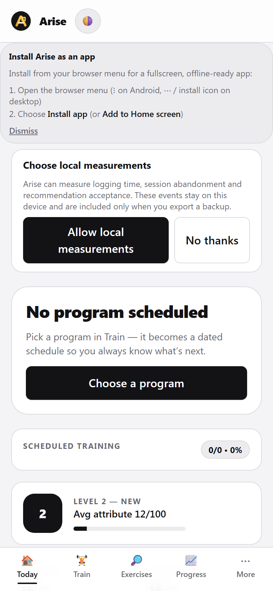
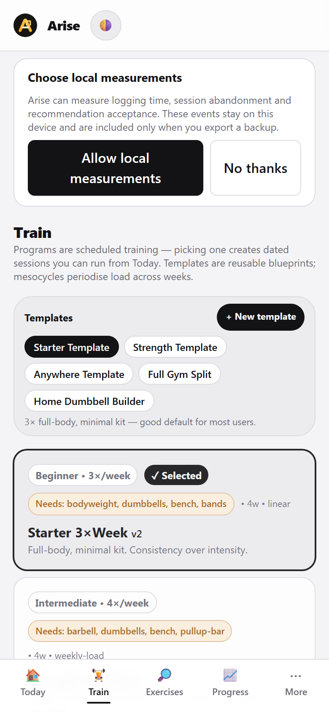
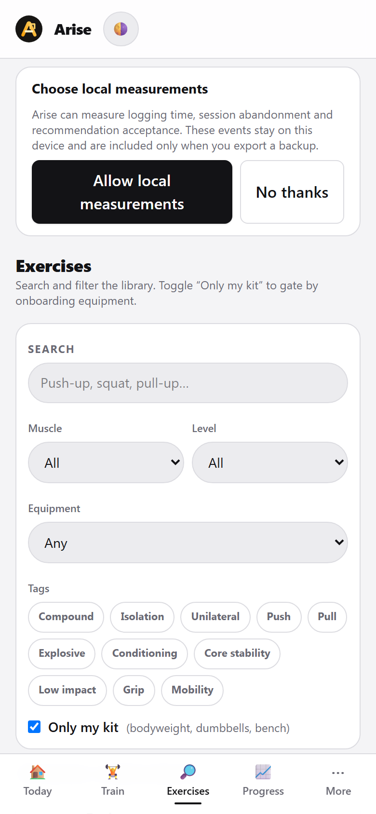
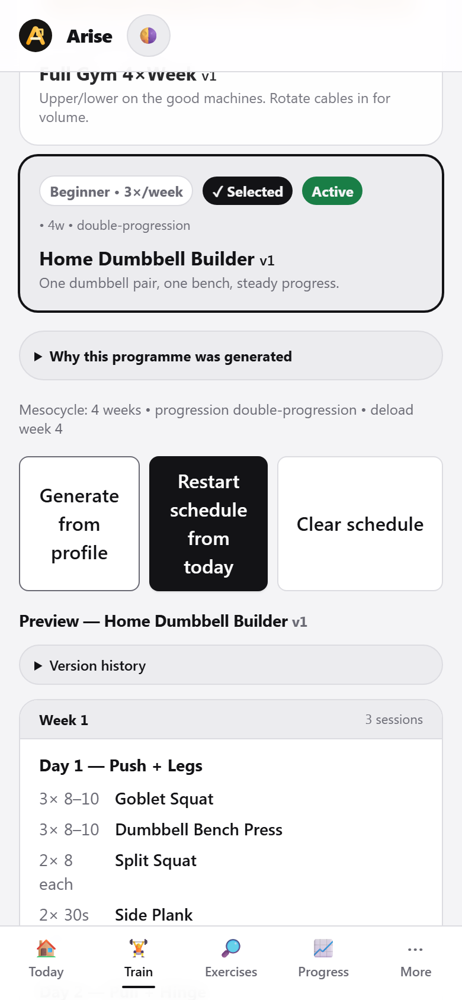
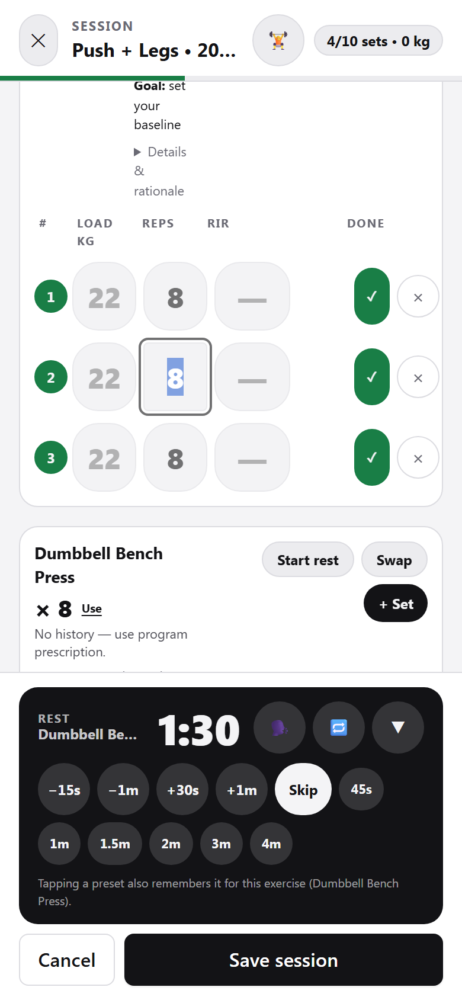
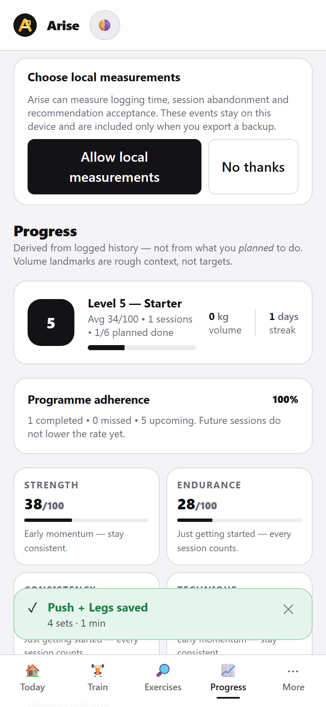
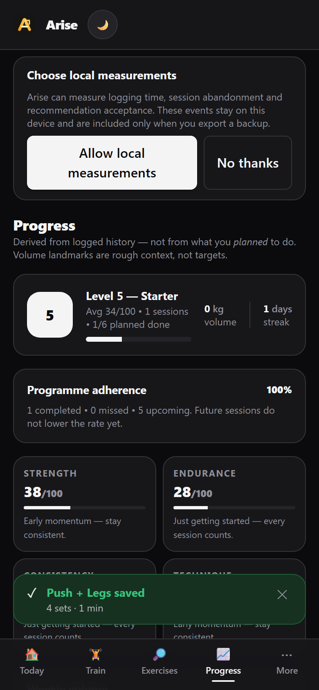

# Screenshot gallery

Captured from the real app by `npm run screenshots` (Playwright drives
onboarding, a scheduled program and a logged session; the data is the
synthetic fixture the script creates). The command builds and starts its own
temporary production preview, so no separate dev server is required. Set
`SHOT_URL` only when intentionally capturing an already-running deployment.

The checked-in images are release documentation. Re-run the command after
meaningful UI changes and review the generated gallery before committing it.

## Today — the session for today

## Train — programs and templates

## Exercises — library and filters

## Today with the scheduled session

## Session runner — logging a set

## Progress — volume, streaks, PRs

## Theme — dark mode

